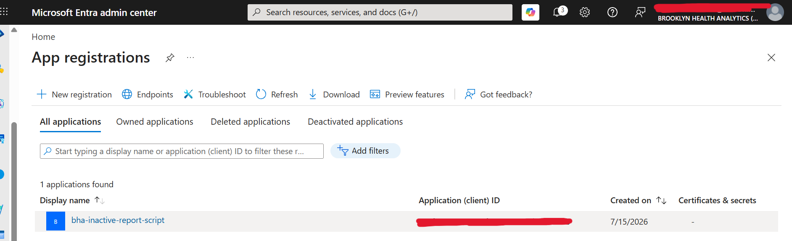
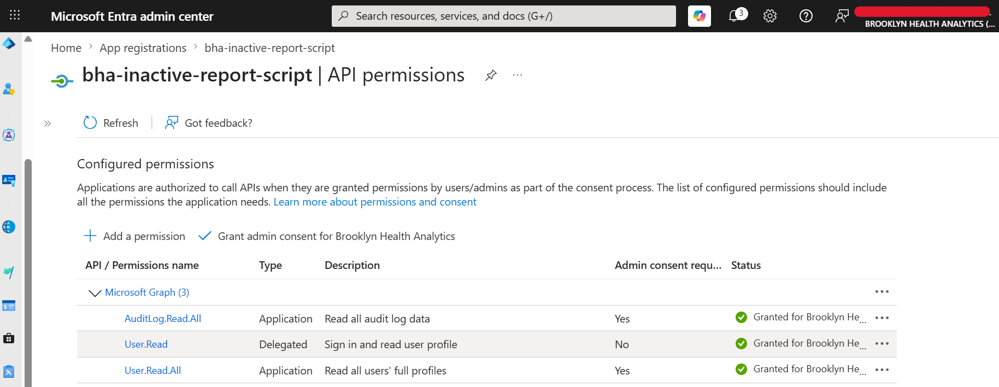
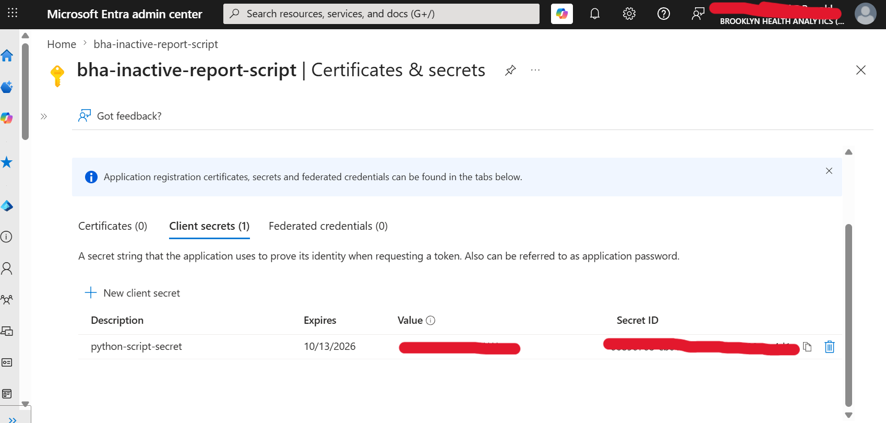
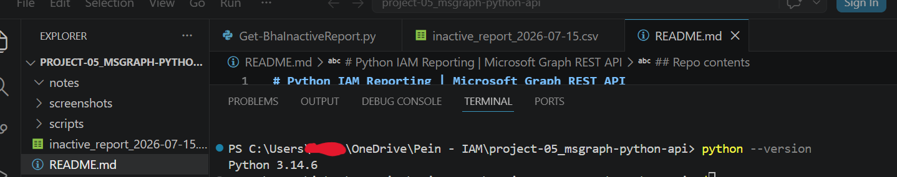
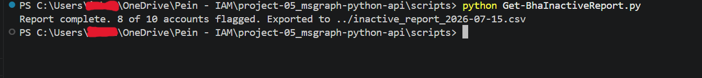
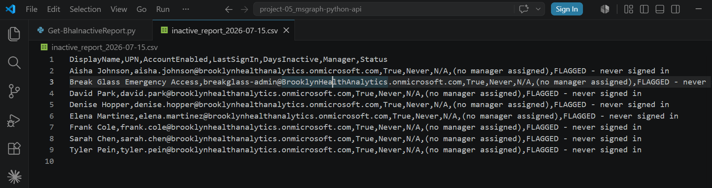

# Python IAM Reporting | Microsoft Graph REST API

An unattended dormant account report for Brooklyn Health Analytics (BHA), a fictional healthcare analytics company used across my portfolio. The script authenticates to Microsoft Graph as its own application identity using the OAuth 2.0 client credentials flow, calls the REST API directly with no SDK, and exports a dated remediation CSV with manager lookup for every flagged account.

This project rebuilds the Week 8 PowerShell inactive report in Python, swapping delegated access for application access and an SDK for raw REST. Same identity question, different language, different auth model, which is the point: the concepts are portable.

## Environment

- Python 3.14 with the requests library
- Microsoft Entra ID tenant, P1 + P2 licensed, 10 users
- App registration with application permissions, admin consented
- VS Code with integrated PowerShell 7 terminal

## The application identity

Every previous Graph session in this portfolio ran delegated: the tool acted as me, bounded by my permissions, requiring a sign-in. This script runs unattended under its own service principal.

The registration follows rules meant for the auditor who finds it later:

- Named for what it does: bha-inactive-report-script, not app1
- Application permissions, read-only: User.Read.All and AuditLog.Read.All, nothing it does not need
- Admin consent granted explicitly, because application permissions have no user present at runtime to consent

The client secret was issued with a 90-day expiry, the shortest offered. Expiry is a feature: a leaked short-lived secret is a contained problem, and long-lived secrets become the forgotten eternal credentials audits find years later. The secret lives in an environment variable. It appears nowhere in code, in this repo, or in any screenshot.

## The script: Get-BhaInactiveReport.py

Design decisions:

- Config is validated before any network call. Missing environment variables fail fast with an instruction, not a stack trace
- Authentication is the raw client credentials flow: a POST to the token endpoint, Bearer token in every request header. No SDK between the code and the protocol
- Pagination is followed via the odata nextLink chain until absent. On a 10-user tenant this changes nothing; on a 10,000-user tenant, skipping it silently truncates the report while looking complete
- HTTP failures raise loudly rather than sliding by as response bodies
- A 404 on the manager lookup is recorded as "(no manager assigned)" rather than treated as an error. An expected absence is data

One command, one result line, and no sign-in prompt anywhere. That silence is the demonstration: this runs at 3am with nobody present.

## Findings

The run flagged 8 of 10 accounts, consistent with the Week 8 PowerShell report. The new column told the real story:

- Every flagged account shows "(no manager assigned)". The manager attribute is unpopulated across the tenant, so a remediation workflow routed by manager would dead-end on 100% of flagged accounts. The tool worked; the data did not. Identity data is only as useful as the attributes populated on it
- This documents a gap in my own earlier automation: the Week 8 provisioning script creates identities without manager assignment, and this report is the first downstream consumer to feel that omission. Named enhancement: a manager column in the hire CSV and a manager assignment call in provisioning
- The break-glass emergency account appears managerless and never signed in. Both are correct by design, and it remains the standing example of a by-design false positive that production cleanup automation would carry on an exclusion list

## Outcomes

- Unattended Graph automation working end to end: app registration, admin-consented application permissions, client credentials flow, raw REST with pagination
- Secret handling done to standard: environment variables, 90-day expiry, zero appearances in code or captures
- A tenant-wide data governance finding surfaced by the report itself, with the remediation path named
- The Week 2 protocol labs closed into practice: the token flow traced by hand in Hoppscotch is now the authentication layer of a working tool

## Repo contents

    scripts/
        Get-BhaInactiveReport.py
    screenshots/